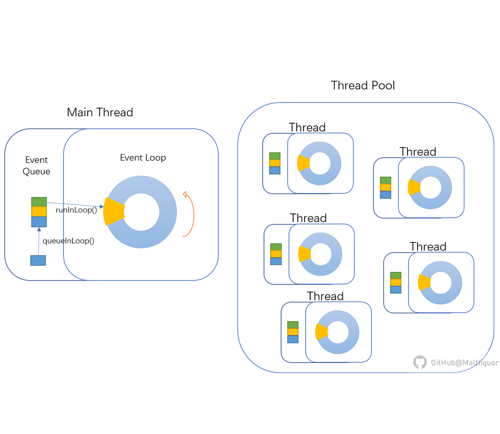
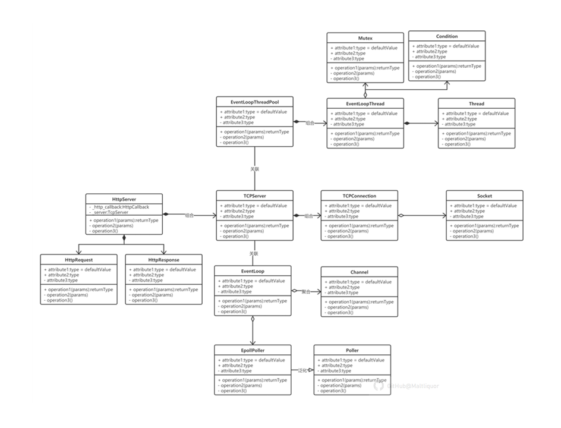
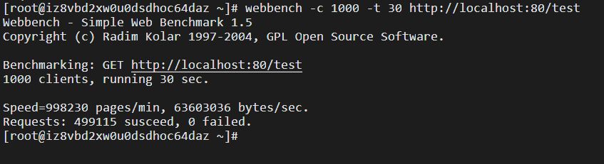

# HttpServer
[](https://opensource.org/licenses/MIT)  
A tiny web server in C++

## Table of Contents

- [Introduction](#Introduction)
- [Environment](#Enviroment)
- [Install](#Install)
- [Usage](#Usage)
- [Model](#Model)
- [Test](#Test)
- [Update](#Update)

## Introduction

- 本项目为参考muduo编写的简化版Web服务器，实现的功能为服务端解析GET请求并返回静态资源、支持HTTP长连接。  
- 代码部分关于thread pool和线程调度的部分采用了muduo的源码，出于后续改进的需要，本项目删除了Buffer类、LogFile相关的类、Timer相关的类以及Acceptor类，并重写了HttpResponse、HttpServer等类的成员函数。
- 测试网址：[HttpServer主页](http://39.101.190.70/)(需等待2~5秒)   [HttpServer测试页](http://39.101.190.70/test)

## Environment

- OS: Ubuntu 16.04
- Compiler: g++ 4.8

## Install

```sh
$ ./build.sh
```

## Usage

```sh
$ cd build/Debug/bin
$ ./demo_server [thread_numbers]
```

## Model

-	本项目采用的并发模型为Reactor模式+One Loop per Thread，图示如下：  


- 类间组织关系如下图：  



## Test

使用webbench进行连接测试  
Nginx测试结果：1000个客户端，持续请求30s，速率为998230 pages/min  
  
 
HttpServer测试结果：1000个客户端，持续请求30s，速率为32616 pages/min  
由结果可见，本服务器在高并发环境下运行效果并不理想，与反向代理引擎nginx相比，性能差距巨大。
| 初始线程数 | 客户端数量 | 持续时长 | 速度(pages)  | 速度(bytes)  | 
| :--------: | :--------: | :---------: | :---------: | :---------: |
| 2          |  100       |30s      |626 p/min    |1742 b/s     | 
| 2          | 1000       |30s      |788 p/min    |2193 b/s     | 
| 2          | 100        |60s      |0   p/min    |0    b/s     | 


由测试结果可见，当初始线程数过少时，客户端之间相互竞争，严重阻塞响应数据，考虑将线程池改为动态扩增的自适应方式，具体参考tcp拥塞中设计的自适应方案；当线程数与客户端数量相适配时，服务端响应的效率波动不大；当客户端响应时间延长时，服务端响应速率有所下降，且测试时发现，开启webbench后，浏览器访问服务端打开网页的速度很慢，说明服务端阻塞严重。
## Update

要实现高并发高性能的Web服务器，需要在以下几个方面进行改进：
- 增加Buffer类：write()写入数据，会阻塞直到全部数据写完。若一次write()未写完所有数据，为避免write()阻塞在线程中，先在buffer类中存储未发送完的数据，立即返回并等待下一次可写事件。
- 增加Timer类：定时器事件是服务端工作的重要组成部分，是心跳包等工作机制实现的基础。系统内产生的多个定时器事件组成了定时器队列，常见的队列组织形式包括时间轮，时间堆，本项目拟采用时间堆的结构操作定时器事件。
- 增加LogFile类：实现异步读写日志的功能。日志记录了服务器运行时的状态，是系统调试和维护的依据。在多线程并发模型中，为生成准确的日志文件，muduo使用双缓冲技术，并成功实现了高效的异步日志记录功能。

